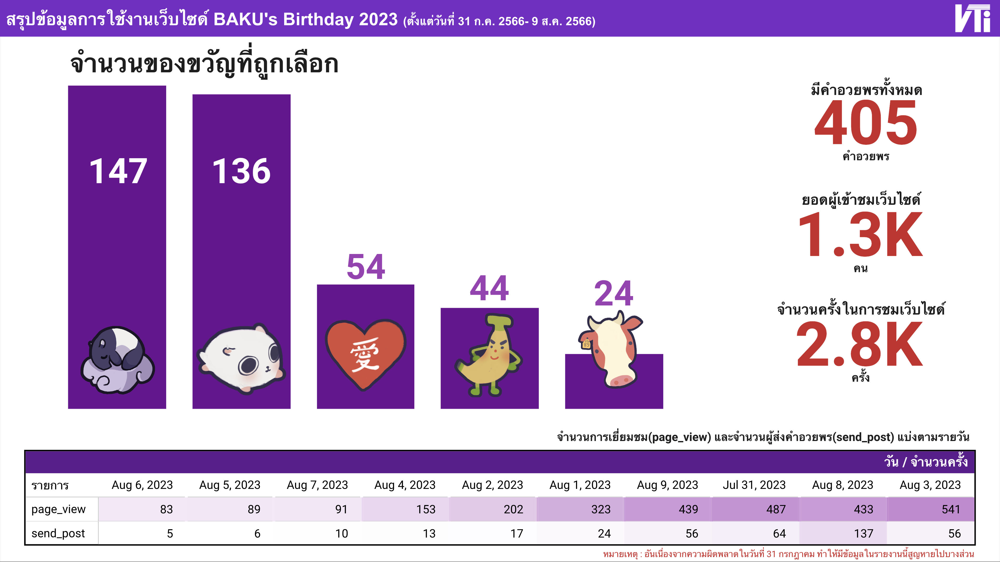

# Baku Birthday 2023 : Website Project



Website for post a wish well to [Baku](https://www.youtube.com/channel/UCO6R8Pc5g2R7ObJQPBGppdg "Baku"), Thai Vtirtual Youtuber from [Algorhythm Project](https://algorhythm.realic.net/ "Algorhythm Project")

Production Website : [https://bakubirthday2023.vtuberthaiinfo.com/](https://bakubirthday2023.vtuberthaiinfo.com/)

## Getting Started

First, run the development server:

```bash
npm run dev
# or
yarn dev
# or
pnpm dev
```

Open [http://localhost:3000](http://localhost:3000) with your browser to see the result.

## Learn More

To learn more about Next.js, take a look at the following resources:

- [Next.js Documentation](https://nextjs.org/docs) - learn about Next.js features and API.
- [Learn Next.js](https://nextjs.org/learn) - an interactive Next.js tutorial.

## Special thanks

- [Dreamerism89 (Baku's Fanclub Group)](https://twitter.com/Dreamerism89)
- [Aito (Project Leads)](https://twitter.com/pks_aito)
- [MAi (UX/UI and Graphic design)](https://twitter.com/imymemai_)
